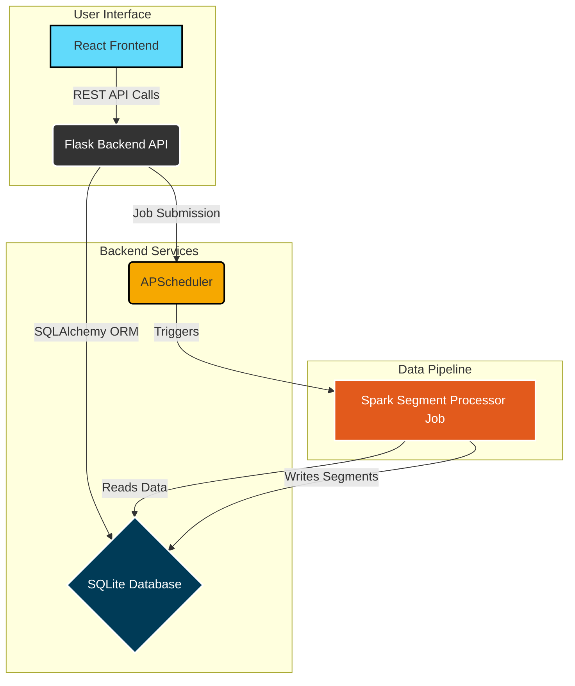
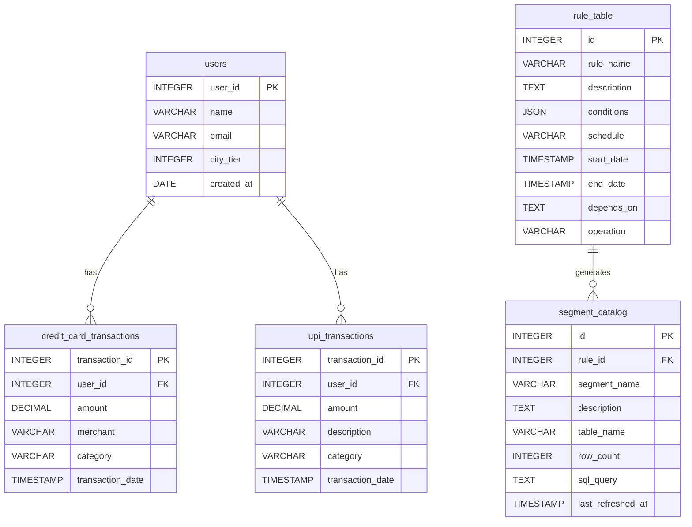

# Audience Manager Platform - Comprehensive Documentation

Welcome to the complete technical documentation for the Audience Manager Platform. This document provides a deep dive into the project's architecture, components, and implementation details.

## Table of Contents
1.  [Project Overview](#project-overview)
2.  [System Architecture](#system-architecture)
3.  [Database Schema](#database-schema)
4.  [Backend API Reference](#backend-api-reference)
5.  [Frontend Application Guide](#frontend-application-guide)
6.  [Development Challenges & Solutions](#development-challenges--solutions)
7.  [Future Improvements](#future-improvements)

---

## 1. Project Overview

*This section will be filled in with a high-level summary of the project's goals, features, and the problems it solves.*

---

## 2. System Architecture

The Audience Manager Platform is built on a modern, decoupled architecture designed for scalability and maintainability. It consists of four primary components: a React-based frontend, a Flask-based backend API, a SQLite database, and an Apache Spark cluster for heavy-duty data processing.

-   **Frontend**: A responsive single-page application (SPA) built with **React** and **TypeScript**, styled with **TailwindCSS**. It provides the user interface for managing rules and viewing segments. All communication with the backend is handled through RESTful API calls.

-   **Backend**: A lightweight and powerful API built with **Flask**. It serves as the central hub, handling business logic, managing database interactions via **SQLAlchemy**, and scheduling data processing jobs. It exposes a set of REST endpoints for the frontend to consume.

-   **Database**: A **SQLite** database stores all persistent data, including user information, transaction records, rule definitions, and segment metadata. Its simplicity is ideal for development and prototyping.

-   **Data Processing Pipeline**: For intensive data processing tasks, the backend leverages **Apache Spark**. An **APScheduler** instance within the Flask application triggers Spark jobs based on rule schedules. These jobs run independently, reading data from the SQLite database, processing it to generate audience segments, and writing the results back into new tables in the database.

This decoupled approach ensures that the user-facing application remains responsive, as long-running data processing tasks are offloaded to the Spark pipeline, which can be scaled independently.

### Architecture Diagram



---

## 3. Database Schema

The database is the backbone of the platform, storing all the data required for audience segmentation. The schema is designed to be simple yet powerful, capturing user data, their transactions, and the rules that define audience segments.

### ER Diagram



### Table Definitions

Below is a detailed description of each table in the database.

#### `users`
Stores basic information about each user in the system.
-   `user_id` (Primary Key): Unique identifier for the user.
-   `name`: The user's full name.
-   `email`: The user's email address.
-   `city_tier`: The tier of the city the user resides in (e.g., 1, 2, 3).
-   `created_at`: The timestamp when the user was added.

#### `credit_card_transactions`
Logs all transactions made by users via credit card.
-   `transaction_id` (Primary Key): Unique identifier for the transaction.
-   `user_id` (Foreign Key): Links to the `users` table.
-   `amount`: The monetary value of the transaction.
-   `merchant`: The merchant where the transaction occurred.
-   `category`: The spending category (e.g., Travel, Groceries).
-   `transaction_date`: The exact date and time of the transaction.

#### `upi_transactions`
Logs all transactions made by users via UPI.
-   `transaction_id` (Primary Key): Unique identifier for the transaction.
-   `user_id` (Foreign Key): Links to the `users` table.
-   `amount`: The monetary value of the transaction.
-   `description`: A brief description of the UPI payment.
-   `category`: The spending category.
-   `transaction_date`: The exact date and time of the transaction.

#### `rule_table`
This is the core of the rule engine. It stores the definitions for each audience segmentation rule.
-   `id` (Primary Key): Unique identifier for the rule.
-   `rule_name`: A unique, human-readable name for the rule.
-   `description`: A detailed description of the rule's purpose.
-   `conditions`: A JSON object defining the filtering logic (e.g., `total_spend > 1000`).
-   `schedule`: A cron string that determines how often the rule is processed.
-   `start_date` / `end_date`: The date range for the transaction data the rule should consider.
-   `depends_on`: A list of rule IDs that this rule depends on, enabling multi-level segmentation.
-   `operation`: The logical operation (e.g., `INTERSECTION`, `UNION`) to apply to the outputs of dependent rules.

#### `segment_catalog`
Acts as a metadata repository for the audience segments generated by the rules.
-   `id` (Primary Key): Unique identifier for the segment.
-   `rule_id` (Foreign Key): Links to the `rule_table` that generates this segment.
-   `segment_name`: A human-readable name for the segment.
-   `description`: A description of the audience in this segment.
-   `table_name`: The name of the physical database table where the segment's user IDs are stored (e.g., `segment_output_123`).
-   `row_count`: The number of users currently in the segment.
-   `sql_query`: The exact SQL query generated by the `RuleParser` to create this segment.
-   `last_refreshed_at`: The timestamp of the last successful processing run.

---

## 4. Backend API Reference

The backend exposes a RESTful API that serves as the interface between the frontend application and the core business logic. All endpoints are prefixed with `/api`.

### Rules API

Endpoints for creating, managing, and triggering audience segmentation rules.

#### `GET /rules`
-   **Description**: Retrieves a paginated list of all rules.
-   **Query Parameters**:
    -   `page` (integer, optional, default: 1): The page number to retrieve.
    -   `per_page` (integer, optional, default: 10): The number of rules per page.
-   **Success Response (200 OK)**:
    ```json
    {
      "items": [
        {
          "id": 1,
          "rule_name": "High Value Customers",
          "description": "Users with total spend over $5000",
          "schedule": "0 0 * * *",
          "depends_on": [],
          "operation": null
        }
      ],
      "total": 1,
      "page": 1,
      "pages": 1
    }
    ```

#### `POST /rules`
-   **Description**: Creates a new rule.
-   **Request Body**:
    ```json
    {
      "rule_name": "New Rule",
      "description": "Rule description",
      "conditions": [{"field": "total_spend", "operator": ">", "value": 100}],
      "schedule": "@daily",
      "start_date": "2025-01-01T00:00:00Z",
      "end_date": "2025-12-31T23:59:59Z"
    }
    ```
-   **Success Response (201 Created)**:
    ```json
    {"message": "Rule created successfully", "rule_id": 2}
    ```

#### `GET /rules/<id>`
-   **Description**: Retrieves a single rule by its ID.
-   **Success Response (200 OK)**:
    ```json
    {
      "id": 1,
      "rule_name": "High Value Customers",
      /* ... other fields ... */
    }
    ```

#### `PUT /rules/<id>`
-   **Description**: Updates an existing rule.
-   **Request Body**: Same as `POST /rules`.
-   **Success Response (200 OK)**:
    ```json
    {"message": "Rule updated successfully"}
    ```

#### `POST /rules/<id>/trigger`
-   **Description**: Manually triggers the execution of a specific rule, queuing a Spark job.
-   **Success Response (202 Accepted)**:
    ```json
    {"message": "Rule trigger has been scheduled"}
    ```

### Segments API

Endpoints for viewing generated segments and their metadata.

#### `GET /segments`
-   **Description**: Retrieves a paginated list of all generated segments.
-   **Success Response (200 OK)**: Similar paginated structure to `GET /rules`.

#### `GET /segments/<id>`
-   **Description**: Retrieves metadata for a single segment.
-   **Success Response (200 OK)**:
    ```json
    {
        "id": 1,
        "segment_name": "High Value Customers",
        "row_count": 150,
        "last_refreshed_at": "...",
        "rule": { "id": 1, "rule_name": "..." }
    }
    ```

#### `GET /segments/<id>/sample_data`
-   **Description**: Retrieves a sample of the data (e.g., 100 rows) from the segment's output table.
-   **Success Response (200 OK)**:
    ```json
    {
      "columns": ["user_id", "name", "email"],
      "data": [
        [101, "John Doe", "john.doe@example.com"],
        [102, "Jane Smith", "jane.smith@example.com"]
      ]
    }
    ```

### Analytics API

Endpoints for retrieving aggregated transaction data.

#### `GET /analytics/summary`
-   **Description**: Provides a high-level summary of key metrics.
-   **Success Response (200 OK)**:
    ```json
    {
      "total_users": 1000,
      "total_transactions": 50000,
      "total_spend": 1250000.00
    }
    ```

---

## 5. Frontend Application Guide

The frontend is a modern Single-Page Application (SPA) built with **React** and **TypeScript**, providing a dynamic and responsive user experience. It uses the **React Router** for navigation and **Axios** for communicating with the backend API. State management is handled within components using React hooks (`useState`, `useEffect`).

### Core Pages

The application is structured around the following core pages, each serving a distinct purpose in the user workflow.

#### `Dashboard.tsx`
-   **Route**: `/`
-   **Purpose**: This is the main landing page after a user logs in. It provides a high-level, at-a-glance overview of the platform's state.
-   **Features**:
    -   Displays key metrics fetched from the `/api/analytics/summary` endpoint (e.g., Total Users, Total Transactions).
    -   Shows a list of the most recently refreshed segments for quick access.

#### `Rules.tsx`
-   **Route**: `/rules`
-   **Purpose**: This page is the central hub for managing all audience definition rules.
-   **Features**:
    -   Displays a paginated list of all created rules, showing their name, description, and schedule.
    -   Provides a button to navigate to the `RuleForm` to create a new rule.
    -   Allows users to click on a rule to view its details or edit it.
    -   Includes a "Trigger" button for each rule to manually queue its execution.

#### `RuleForm.tsx`
-   **Route**: `/rules/new` and `/rules/edit/:id`
-   **Purpose**: This is the form where users create or modify rules. It's the most complex interactive component in the application.
-   **Features**:
    -   Allows users to set a rule's name, description, and processing schedule (e.g., `@daily`).
    -   Features a dynamic condition builder where users can add multiple filter criteria (e.g., `total_spend > 1000`, `city_tier = 1`).
    -   Includes a date range selector to define the time window for transaction data.
    -   Handles both creating a new rule (`POST /api/rules`) and updating an existing one (`PUT /api/rules/:id`).

#### `Segments.tsx`
-   **Route**: `/segments`
-   **Purpose**: This page displays the results of the rule processing—the generated audience segments.
-   **Features**:
    -   Shows a paginated list of all segments from the `segment_catalog`.
    -   For each segment, it displays the name, the number of users (`row_count`), and when it was last refreshed.
    -   Shows which rule generated the segment and if it depends on other segments.
    -   Provides a "View" button to navigate to the `SegmentDetail` page.

#### `SegmentDetail.tsx`
-   **Route**: `/segments/:id`
-   **Purpose**: Provides a closer look at a specific, generated audience segment.
-   **Features**:
    -   Displays detailed metadata about the segment, such as its name, description, and the rule that created it.
    -   Fetches and displays a sample of the users belonging to that segment from the `/api/segments/:id/sample_data` endpoint.
    -   Includes lineage information, showing if the segment was created by combining other segments.

---

## 6. Development Challenges & Solutions

This project involved several technical challenges. This section documents the most significant ones and the solutions we implemented.

#### 1. Database Schema Evolution
-   **Challenge**: As the application's requirements grew, we frequently needed to add columns to our database tables (e.g., adding `sql_query` and `depends_on` to the `rule_table`). Performing these changes on a live SQLite database without data loss was tricky.
-   **Solution**: Initially, we wrote custom Python scripts to perform migrations (e.g., creating a new table, copying data, and replacing the old table). This highlighted the need for a more robust solution. While we didn't fully integrate it, we identified **Alembic** (a tool used with Flask-Migrate) as the standard solution for managing schema changes systematically.

#### 2. Spark Integration & Environment Configuration
-   **Challenge**: Getting the Flask backend to correctly communicate with and trigger the Spark processing jobs was complex. We had to ensure the Spark environment could access our application's code and connect to the database.
-   **Solution**:
    -   We configured the `APScheduler` within Flask to call `spark-submit` with the correct parameters.
    -   We dynamically set the `PYTHONPATH` environment variable in the scheduler to make our project's modules available to the Spark job.
    -   We passed the database URI as a command-line argument to the Spark script, decoupling it from the Flask configuration.
    -   We resolved a `Scheduler is already running` error by refactoring the manual trigger endpoint to **enqueue** a job with the existing scheduler instance, rather than attempting to execute it directly.

#### 3. Automatic Dependency Detection
-   **Challenge**: Manually defining dependencies between rules was cumbersome and error-prone. We needed a system that could automatically find opportunities to reuse existing segments to build new ones.
-   **Solution**: We created the `DependencyFinder` utility. This component analyzes the conditions of a new rule and compares them against the conditions of all existing rules. It finds subsets of logic that can be reused, automatically setting the `depends_on` and `operation` fields (`INTERSECTION` or `UNION`) to build an efficient execution plan. This significantly improved performance by avoiding redundant computation.

#### 4. Frontend State Management and API Synchronization
-   **Challenge**: Keeping the frontend UI consistent with the backend state, especially with paginated data and asynchronous operations like triggering a rule, was a recurring issue.
-   **Solution**: We implemented several best practices:
    -   **Consistent Interfaces**: We defined clear TypeScript interfaces for all API responses, ensuring type safety.
    -   **State-driven UI**: We used loading and error states to provide clear feedback to the user during API calls.
    -   **Data Refetching**: After a successful action (like creating or triggering a rule), we programmatically refetched the relevant data to ensure the UI immediately reflected the new state.

---

## 7. Future Improvements

The current platform is a robust and functional tool, but there are many opportunities for future enhancements.

#### 1. Interactive Segment Lineage Graph
-   **Description**: While the backend now tracks dependencies, the frontend could visualize this lineage. An interactive graph (using a library like **React Flow**) on the Segment Detail page would allow users to visually trace how a complex segment was built from its parent segments.

#### 2. Production-Grade Infrastructure
-   **Description**: To move the application to a production environment, several components should be upgraded:
    -   **Database**: Migrate from SQLite to a more scalable and concurrent database like **PostgreSQL** or **MySQL**.
    -   **Containerization**: Use **Docker** and **Docker Compose** to containerize the frontend, backend, and database services for consistent, isolated, and easily deployable environments.
    -   **Spark Cluster**: Instead of running in local mode, configure the application to submit jobs to a standalone **Spark cluster** for true parallel processing.

#### 3. Enhanced Rule Conditions & Operations
-   **Description**: The rule engine could be extended to support more complex conditions:
    -   **Time-windowed aggregations** (e.g., "users who spent > $100 in the last 30 days").
    -   **Geospatial filters** (e.g., "users within 10km of a specific location").
    -   Additional dependency operations like `DIFFERENCE` (A not in B).

#### 4. Comprehensive Test Suite
-   **Description**: While we tested manually throughout development, building a formal testing suite would improve stability and confidence in future changes. This would include:
    -   **Unit Tests** for backend utilities (like `RuleParser`) and frontend components.
    -   **Integration Tests** for the API endpoints.
    -   **End-to-End Tests** to simulate user flows across the entire application.
